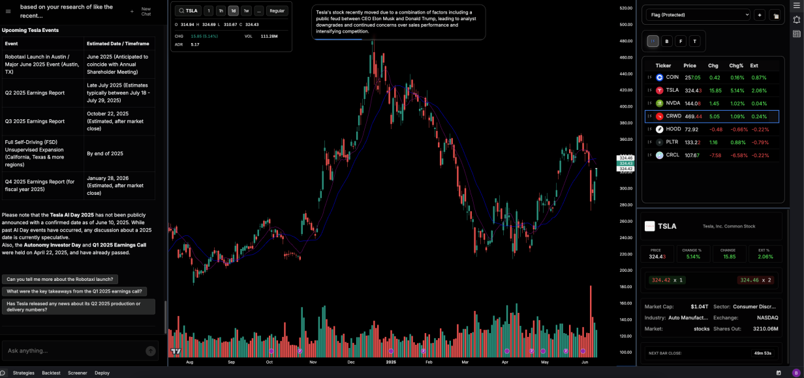

# Peripheral Trading Platform

A high-performance, AI-powered trading research and strategy development platform built with modern microservices architecture.



## Architecture Overview

Peripheral is designed as a microservices-based trading platform that combines real-time market data processing, AI-powered analysis, and sophisticated strategy backtesting capabilities. The platform emphasizes performance, security, and scalability across four main services.

```
┌─────────────────┐     ┌─────────────────┐     ┌─────────────────┐
│    Frontend     │     │     Backend     │     │     Worker      │
│   (SvelteKit)   │─────│    (Go/Gin)     │─────│    (Python)     │
└─────────────────┘     └─────────────────┘     └─────────────────┘
         │                       │                       │
         └───────────────────────┼───────────────────────┘
                                 │
                 ┌───────────────┴───────────────┐
                 │                               │
        ┌─────────────────┐             ┌─────────────────┐
        │    Database     │             │      Cache      │
        │  (PostgreSQL)   │             │     (Redis)     │
        └─────────────────┘             └─────────────────┘
```

## Core Features

### Real-Time Market Intelligence
* **High-Resolution Charting**: Full coverage of all US equities with timeframes down to 1-second resolution for precise technical analysis.
* **AI Market Assistant**: Surface relevant market information including SEC filings, earnings transcripts, technical indicators, social sentiment, and fundamental data through an integrated conversational interface.
* **Natural Language Strategy Development**: Create, edit, and refine custom trading strategies using plain English. The AI handles the underlying code generation and validation.

### Advanced Strategy Engine
* **Backtesting and Screening**: Rapidly test strategies against historical data and run real-time scanners across the entire equity universe.
* **Automated Alerting**: Set complex, multi-factor alerts on custom strategies that trigger instantly when market conditions are met.
* **Sandboxed Execution**: Secure execution environment for Python-based strategy logic, ensuring high performance without compromising system integrity.

## Core Design Decisions

### 1. Microservices Architecture
* **Rationale**: Enables independent scaling, deployment, and technology choices per service.
* **Implementation**: Containerized services with Docker, orchestrated via Kubernetes.
* **Benefits**: Language optimization per domain (Go for API performance, Python for ML/analytics).

### 2. Performance-First Strategy Engine
* **Rationale**: Trading requires sub-millisecond execution for real-time opportunities.
* **Implementation**: Numpy-based processing instead of Pandas, PyPy optimization.
* **Impact**: Significant performance improvement over traditional DataFrame approaches.

### 3. Security-by-Design
* **Rationale**: Financial data requires enterprise-grade security.
* **Implementation**: Code sandboxing, input validation, secure execution environments.
* **Features**: Strategy code validation, restricted execution contexts, audit logging.

### 4. Event-Driven Communication
* **Rationale**: Real-time market data requires immediate propagation.
* **Implementation**: Redis pub/sub, WebSocket connections, queue-based processing.
* **Benefits**: Low-latency updates, horizontal scaling, fault tolerance.

## Repository Structure

```
Peripheral/
├── services/                    # Core microservices
│   ├── backend/                 # Go API server
│   ├── frontend/                # SvelteKit UI
│   ├── worker/                  # Python strategy engine
│   ├── db/                      # PostgreSQL setup
│   └── cache/                   # Redis configuration
├── config/                      # Deployment configurations
│   ├── deploy/                  # Kubernetes manifests
│   ├── dev/                     # Development environment
│   └── logging/                 # Logging configuration
└── workflows/                   # CI/CD pipelines
```

## Services Deep Dive

### Backend Service (Go)
**Location**: `services/backend/`
**Purpose**: High-performance API server and business logic

#### Key Components:
* **REST API Server** (`internal/server/`) - Gin-based HTTP server
* **Agent System** (`internal/app/agent/`) - AI-powered conversation management
* **Strategy Management** (`internal/app/strategy/`) - Strategy lifecycle management
* **Market Data** (`internal/app/chart/`, `internal/app/filings/`) - Real-time data processing
* **Authentication** (`internal/app/settings/`) - OAuth and session management

### Frontend Service (SvelteKit)
**Location**: `services/frontend/`
**Purpose**: Modern web interface for trading research and analysis

#### Key Components:
* **Chart Interface** (`src/lib/features/chart/`) - Interactive high-resolution charting
* **Strategy Builder** (`src/lib/features/strategies/`) - Natural language strategy interface
* **Chat Interface** (`src/lib/features/chat/`) - AI assistant integration
* **Real-time Updates** (`src/lib/utils/stream/`) - WebSocket data streaming

### Worker Service (Python)
**Location**: `services/worker/`
**Purpose**: High-performance strategy execution and market analysis

#### Key Components:
* **Strategy Engine** (`src/engine.py`) - Core execution engine
* **Data Provider** (`src/utils/data_accessors.py`) - Market data fetching and caching
* **Security Validator** (`src/validator.py`) - Code safety verification
* **Queue System** (`worker.py`) - Task queue management

#### Performance Optimizations:
```python
async def execute_screening(self, strategy_code: str, universe: List[str]) -> Dict:
    # Optimized data loading
    data_array = await self._load_optimized_data(universe)
    
    # Sandboxed execution
    exec(strategy_code, safe_globals, safe_locals)
    
    # Results processing
    results = strategy_func(data_array)
```

### Database Service (PostgreSQL)
**Location**: `services/db/`
**Purpose**: Persistent data storage with optimized schemas

#### Key Components:
* **Migrations** (`migrations/`) - Database migration versioning
* **Initialization** (`init/`) - Base schema and seed data
* **Backup System** (`scripts/`) - Automated backup and recovery scripts

## Development & Deployment

### CI/CD Pipeline
**Location**: `./workflows/`

#### Workflows:
1. **Branch Protection** - Prevents direct pushes to main
2. **Lint and Build** - Comprehensive code quality checks
   * Backend: Go vet, staticcheck, golangci-lint, gosec
   * Frontend: ESLint, Svelte checks, Jest tests
   * Worker: flake8, mypy, bandit, safety checks

## Security Architecture

### Code Execution Security
```python
# Strategy code validation before execution
prohibited_operations = [
    'import os', 'import sys', 'import subprocess', 'import shutil',
    'import socket', 'import urllib', 'open(', 'eval(', 'exec(',
    'compile(', 'globals(', 'locals(', '__import__'
]

# Sandboxed execution environment
safe_globals = {
    'pd': pd, 'numpy': np,
    'data': data_array,
}
```

### Security Measures:
* **Input Validation**: All user inputs sanitized and validated
* **Code Sandboxing**: Restricted execution environment for strategy code
* **Authentication**: OAuth 2.0 + JWT token-based authentication
* **Network Security**: HTTPS/TLS encryption, API rate limiting
* **Audit Logging**: Comprehensive activity tracking

## Contributing

### Development Setup
```bash
# Clone repository
git clone https://github.com/your-org/Peripheral.git

# Start development environment
cd Peripheral
docker-compose -f config/dev/docker-compose.yaml up
```

---

**Built for traders, by traders**
