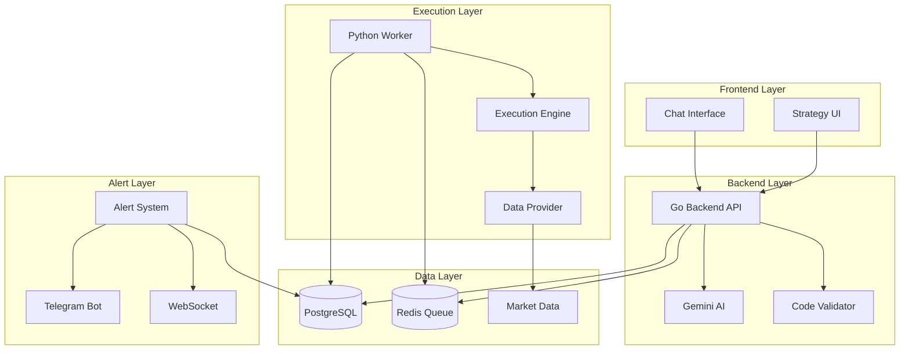

# Trading Strategy Infrastructure

A comprehensive AI-powered trading strategy system that transforms natural language descriptions into executable Python strategies for backtesting, screening, and real-time alerting.

## 🏗️ System Architecture

The system consists of multiple interconnected layers working together to provide a complete strategy development and execution platform:



## 📋 Core Components

### 1. Natural Language Processing
- **Gemini AI Integration**: Converts user prompts into executable Python code
- **Pattern Recognition**: Identifies common trading patterns (gaps, momentum, value)
- **Context-Aware Generation**: Handles symbol-specific and pattern-specific requests

### 2. Code Generation & Validation
- **Python Code Generation**: Creates `classify_symbol()` functions from natural language
- **Multi-layer Security**: AST analysis, pattern matching, execution sandboxing
- **Performance Optimization**: PyPy-compatible code for maximum execution speed

### 3. Execution Modes
- **Real-time Alerting**: Continuous monitoring with instant notifications
- **Backtesting**: Historical performance analysis with comprehensive metrics
- **Screening**: Universe-wide pattern detection and ranking

### 4. Data Access Layer
- **Comprehensive Market Data**: OHLCV, fundamentals, options, sentiment
- **High-Performance Access**: Optimized data retrieval with caching
- **Real-time & Historical**: Support for both live and historical analysis

## 🚀 Strategy Creation Pipeline

### Step 1: User Input
Users describe their trading strategy in natural language through the web interface:

```typescript
// Frontend: strategies.svelte
async function createStrategy() {
    const response = await privateRequest('createStrategyFromPrompt', {
        query: newPrompt,
        strategyId: -1  // -1 for new strategy
    });
}
```

**Example User Prompts:**
- "Find stocks that gap up by more than 3% with high volume"
- "Identify oversold technology stocks with RSI below 30"
- "Detect unusual options activity with positive earnings momentum"
- "Find ARM when it gaps up by 5%"

### Step 2: AI Processing
The Go backend processes the request using Gemini AI:

```go
// services/backend/internal/app/strategy/strategies.go
func CreateStrategyFromPrompt(conn *data.Conn, userID int, rawArgs json.RawMessage) (interface{}, error) {
    // 1. Parse and validate input
    var args CreateStrategyFromPromptArgs
    json.Unmarshal(rawArgs, &args)
    
    // 2. Handle editing vs new strategy creation
    isEdit := args.StrategyID != -1
    
    // 3. Get Gemini API client
    apikey, _ := conn.GetGeminiKey()
    client, _ := genai.NewClient(context.Background(), &genai.ClientConfig{
        APIKey: apikey,
        Backend: genai.BackendGeminiAPI,
    })
    
    // 4. Load system instruction and create enhanced prompt
    systemInstruction, _ := getSystemInstruction("classifier")
    enhancedQuery := enhanceQueryForPatterns(args.Query)
    fullPrompt := fmt.Sprintf(`%s\n\nUser Request: %s`, dataAccessorFunctions, enhancedQuery)
    
    // 5. Generate Python code using Gemini
    result, _ := client.Models.GenerateContent(context.Background(), "gemini-2.5-flash", content, config)
    
    // 6. Extract and validate generated code
    pythonCode := extractPythonCode(result)
    description := extractDescription(result)
    
    // 7. Save to database
    strategyID, _ := saveStrategy(conn, userID, name, description, args.Query, pythonCode)
    
    return finalStrategy, nil
}
```

### Step 3: Code Generation
Gemini AI generates Python code based on the system instruction:

**System Instruction (NEW ACCESSOR PATTERN ONLY):**
```text
You are a Python trading strategy developer. Generate ONLY Python code using the NEW ACCESSOR PATTERN.

CRITICAL: ONLY USE THE NEW ACCESSOR PATTERN
- Function signature: def strategy(): (NO PARAMETERS)
- Use data accessor functions to fetch data inside the function

DATA ACCESS SYSTEM:
- get_bar_data(timeframe="1d", columns=[], min_bars=1) -> numpy array
- get_general_data(columns=[]) -> pandas DataFrame

REQUIREMENTS:
- Return format: [{'ticker': str, 'timestamp': str, 'signal': True, ...}]
```

**Generated Code Example (NEW PATTERN):**
```python
def strategy():
    """
    ARM gap-up detection using new accessor pattern.
    """
    instances = []
    
    # Get recent bar data using accessor function
    bar_data = get_bar_data(
        timeframe="1d",
        columns=["ticker", "timestamp", "open", "close"],
        min_bars=2
    )
    
    if len(bar_data) == 0:
        return instances
    
    # Convert to DataFrame for processing
    import pandas as pd
    df = pd.DataFrame(bar_data, columns=["ticker", "timestamp", "open", "close"])
    df['date'] = pd.to_datetime(df['timestamp'], unit='s').dt.date
    df = df.sort_values(['ticker', 'date']).copy()
    
    # Filter for ARM only
    df_arm = df[df['ticker'] == 'ARM']
    
    if len(df_arm) < 2:
        return instances
    
    # Calculate gap percentage
    df_arm['prev_close'] = df_arm['close'].shift(1)
    df_arm['gap_pct'] = ((df_arm['open'] - df_arm['prev_close']) / df_arm['prev_close']) * 100
    
    # Filter for gaps >= 2%
    gaps = df_arm[df_arm['gap_pct'] >= 2.0]
    
    for _, row in gaps.iterrows():
        instances.append({
            'ticker': 'ARM',
            'timestamp': str(row['date']),
            'signal': True,
            'gap_percent': round(row['gap_pct'], 2),
            'message': f"ARM gapped up {row['gap_pct']:.2f}%"
        })
    
    return instances
```

### Step 4: Validation & Security
Multi-layer security validation ensures code safety:

```python
# services/worker/src/execution_engine.py
class CodeValidator:
    def validate(self, code: str) -> bool:
        # 1. AST-based validation
        tree = ast.parse(code)
        for node in ast.walk(tree):
            if isinstance(node, ast.Call):
                if self._is_prohibited_call(node):
                    return False
        
        # 2. String-based pattern matching
        for pattern in self.prohibited_patterns:
            if pattern in code.lower():
                return False
        
        return True
```

**Security Layers:**
- ✅ **AST Analysis**: Parses code structure to detect prohibited operations
- ✅ **Pattern Matching**: Scans for dangerous code patterns  
- ✅ **Import Restrictions**: Only allows whitelisted modules
- ✅ **Execution Sandboxing**: Runs in restricted Python environment
- ✅ **Resource Limits**: Memory (128MB) and CPU time (30s) constraints

### Step 5: Database Storage
Strategies are stored with comprehensive metadata:

```sql
-- Database schema
CREATE TABLE strategies (
    strategyId SERIAL PRIMARY KEY,
    userId INT REFERENCES users(userId),
    name VARCHAR(255) NOT NULL,
    description TEXT,
    prompt TEXT,
    pythonCode TEXT,
    score INTEGER DEFAULT 0,
    version VARCHAR(20) DEFAULT '1.0',
    createdAt TIMESTAMP DEFAULT NOW(),
    isAlertActive BOOLEAN DEFAULT FALSE
);
```

## 🧠 Pattern Recognition & Enhancement

The system recognizes and enhances common trading patterns:

### Gap Analysis
```go
// Enhanced query processing for gap patterns
if strings.Contains(strings.ToLower(args.Query), "gap") &&
    (strings.Contains(strings.ToUpper(args.Query), "ARM") ||
     strings.Contains(strings.ToLower(args.Query), "arm ")) {
    
    enhancedQuery = fmt.Sprintf(`%s

IMPORTANT: This query is asking specifically for ARM (ticker: ARM) gap-up analysis. 
- Create a classifier that checks if the ARM symbol specifically gaps up by the specified percentage
- A gap up means: current day's opening price > previous day's closing price by the specified percentage
- Use the formula: gap_percent = ((current_open - previous_close) / previous_close) * 100
- Make sure to handle the ARM symbol specifically in your classifier`, args.Query)
}
```

### Pattern Types Supported

| Pattern Type | Description | Example Query |
|-------------|-------------|---------------|
| **Gap Patterns** | Price gaps up/down | "Find stocks gapping up 3%+" |
| **Volume Patterns** | Unusual volume activity | "High volume breakouts" |
| **Technical Patterns** | RSI, MACD, Bollinger Bands | "RSI oversold conditions" |
| **Fundamental Patterns** | P/E, earnings, revenue | "Low P/E value stocks" |
| **Momentum Patterns** | Price momentum, trend | "Momentum breakouts with volume" |
| **Sector Patterns** | Sector-specific analysis | "Technology stocks outperforming" |

## 🔄 Strategy Editing

The system supports intelligent strategy editing:

```go
if isEdit && existingStrategy != nil {
    // For editing existing strategies, include current strategy content
    fullPrompt = fmt.Sprintf(`%s

EDITING EXISTING STRATEGY:

Current Strategy Name: %s
Current Description: %s
Original Prompt: %s

Current Python Code:
%s

User's Edit Request: %s

Please modify the existing strategy based on the user's edit request.`, 
        dataAccessorFunctions,
        existingStrategy.Name,
        existingStrategy.Description,
        existingStrategy.Prompt,
        existingStrategy.PythonCode,
        enhancedQuery)
}
```

**Editing Capabilities:**
- **Logic Updates**: Modify thresholds, criteria, or calculations
- **Feature Addition**: Add new data sources or indicators
- **Bug Fixes**: Correct issues in existing strategies
- **Performance Improvements**: Optimize execution speed
- **Name Changes**: Update strategy names and descriptions

## 📊 Next: Execution Modes

The next sections will cover:
- **Execution Modes**: Real-time alerting, backtesting, and screening
- **Data Access Layer**: Comprehensive market data functions
- **Performance Optimization**: PyPy compatibility and caching
- **Security Implementation**: Detailed security measures
- **API Reference**: Complete API documentation

---

*This is Part 1 of the Strategy Infrastructure documentation. Continue reading for detailed information about execution modes, backtesting, screening, and alerting systems.* 