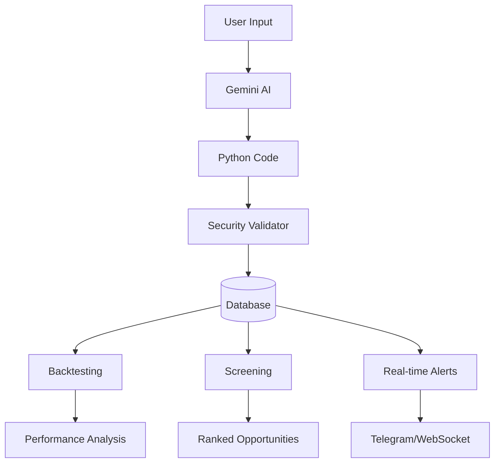

# AI Trading Strategy Infrastructure

A comprehensive system that transforms natural language descriptions into executable Python trading strategies for backtesting, screening, and real-time alerting.

## 🏗️ System Overview



## 🚀 Strategy Creation Pipeline

### 1. Natural Language Input
Users describe trading strategies in plain English:

**Examples:**
- "Find stocks that gap up by more than 3% with high volume"
- "Identify oversold technology stocks with RSI below 30"
- "Detect ARM when it gaps up by 5%"

### 2. AI Code Generation
Gemini AI converts descriptions into Python code:

```python
def classify_symbol(symbol):
    """Generated strategy for gap-up detection"""
    try:
        price_data = get_price_data(symbol, timeframe='1d', days=5)
        if not price_data.get('open') or len(price_data['open']) < 2:
            return False
        
        current_open = price_data['open'][-1]
        previous_close = price_data['close'][-2]
        gap_percent = ((current_open - previous_close) / previous_close) * 100
        
        return gap_percent > 3.0  # 3% gap threshold
    except Exception:
        return False
```

### 3. Security Validation
Multi-layer security ensures code safety:
- **AST Analysis**: Parses code structure for prohibited operations
- **Pattern Matching**: Scans for dangerous code patterns
- **Execution Sandboxing**: Restricted Python environment
- **Resource Limits**: Memory (128MB) and CPU (30s) constraints

### 4. Database Storage
Strategies stored with metadata for execution:

```sql
CREATE TABLE strategies (
    strategyId SERIAL PRIMARY KEY,
    userId INT,
    name VARCHAR(255),
    description TEXT,
    prompt TEXT,
    pythonCode TEXT,
    isAlertActive BOOLEAN DEFAULT FALSE
);
```

## ⚙️ Execution Modes

### 1. Real-time Alerting 🚨

Continuous monitoring with instant notifications:

```python
def run_realtime_scan(symbols):
    """Real-time momentum scanning"""
    alerts = []
    signals = {}
    
    for symbol in symbols:
        if classify_symbol(symbol):
            alerts.append({
                'symbol': symbol,
                'type': 'momentum_breakout',
                'message': f"{symbol} triggered strategy",
                'timestamp': datetime.utcnow().isoformat()
            })
    
    return {'alerts': alerts, 'signals': signals}
```

**Alert Flow:**
1. Strategy executes every second on active symbols
2. Positive signals trigger notifications
3. Alerts sent via Telegram and WebSocket
4. Results logged to database

### 2. Backtesting 📈

Historical performance analysis:

```python
def run_batch_backtest(start_date, end_date, symbols):
    """Value investing backtest"""
    instances = []
    
    for symbol in symbols:
        fundamentals = get_fundamental_data(symbol)
        if not fundamentals:
            continue
        
        pe_ratio = fundamentals.get('pe_ratio', float('inf'))
        market_cap = fundamentals.get('market_cap', 0)
        
        if pe_ratio < 15 and market_cap > 1000000000:
            instances.append({
                'ticker': symbol,
                'timestamp': int(datetime.utcnow().timestamp() * 1000),
                'classification': True,
                'pe_ratio': pe_ratio,
                'expected_return': (20 - pe_ratio) * 0.02
            })
    
    performance_metrics = {
        'total_picks': len(instances),
        'average_pe': sum(i['pe_ratio'] for i in instances) / len(instances) if instances else 0
    }
    
    return {'instances': instances, 'performance_metrics': performance_metrics}
```

**Backtest Process:**
1. Strategy runs against 2 years of historical data
2. Results include entry points and future returns
3. Performance metrics calculated automatically
4. Results cached for fast retrieval

### 3. Screening 🔍

Universe-wide opportunity detection:

```python
def run_screening(universe, limit):
    """Momentum screening across universe"""
    scored_symbols = []
    
    for symbol in universe:
        price_data = get_price_data(symbol, timeframe='1d', days=30)
        if not price_data.get('close'):
            continue
        
        # Calculate momentum score
        returns_5d = (price_data['close'][-1] / price_data['close'][-6]) - 1
        volume_ratio = price_data['volume'][-1] / np.mean(price_data['volume'][-10:])
        momentum_score = (returns_5d * 2) + (volume_ratio * 0.1)
        
        if momentum_score > 0.05:
            scored_symbols.append({
                'symbol': symbol,
                'score': momentum_score,
                'returns_5d': returns_5d
            })
    
    scored_symbols.sort(key=lambda x: x['score'], reverse=True)
    return {'ranked_results': scored_symbols[:limit]}
```

**Screening Features:**
- Processes entire market universes (S&P 500, NASDAQ 100, etc.)
- Ranks opportunities by strategy-specific scores
- Supports custom universe creation with filters
- Results updated in real-time

## 📊 Data Access Layer

Comprehensive market data through standardized functions:

### Price Data
```python
# OHLCV data with flexible timeframes
get_price_data(symbol, timeframe='1d', days=30)
# Returns: {'timestamps': [...], 'open': [...], 'high': [...], 'low': [...], 'close': [...], 'volume': [...]}

# Multiple symbols efficiently
get_multiple_symbols_data(symbols, timeframe='1d', days=30)
```

### Fundamental Data
```python
# Company fundamentals
get_fundamental_data(symbol)
# Returns: {'market_cap': 1000000000, 'pe_ratio': 15.5, 'eps': 5.25}

# Earnings data
get_earnings_data(symbol, quarters=8)
```

### Market Data
```python
# Sector performance
get_sector_data(sector='Technology', days=5)

# Universe screening
scan_universe(filters={'min_market_cap': 1000000000}, limit=100)
```

## 🔒 Security Implementation

### Code Validation
```python
class CodeValidator:
    def validate(self, code: str) -> bool:
        # AST-based validation
        tree = ast.parse(code)
        for node in ast.walk(tree):
            if self._is_prohibited_operation(node):
                return False
        
        # String pattern matching
        for pattern in self.prohibited_patterns:
            if pattern in code.lower():
                return False
        
        return True
```

**Security Layers:**
- ✅ AST analysis for dangerous operations
- ✅ Import restrictions (only whitelisted modules)
- ✅ File system access blocked
- ✅ Network operations prohibited
- ✅ Resource limits enforced

## ⚡ Performance Optimization

### PyPy Compatibility
Strategies optimized for PyPy JIT compilation:
- Native Python data structures (lists, dicts)
- NumPy for mathematical operations
- No pandas DataFrame overhead
- List comprehensions over loops

### Caching Strategy
```python
# Multi-level caching
class CacheManager:
    def __init__(self):
        self.memory_cache = {}  # In-memory for recent data
        self.redis_client = redis.Redis()  # Shared cache
    
    async def get_cached_data(self, key, fetch_func, ttl=300):
        # Check memory -> Redis -> fetch fresh
        if key in self.memory_cache:
            return self.memory_cache[key]
        
        cached = self.redis_client.get(key)
        if cached:
            return json.loads(cached)
        
        data = await fetch_func()
        self.redis_client.setex(key, ttl, json.dumps(data))
        return data
```

### Batch Processing
- Bulk data loading for multiple symbols
- Parallel strategy execution
- Optimized database queries
- Connection pooling

## 🚨 Alert System Architecture

### Alert Processing Loop
```go
func alertLoop(ctx context.Context, conn *data.Conn) {
    ticker := time.NewTicker(time.Second) // 1 second frequency
    defer ticker.Stop()
    
    for {
        select {
        case <-ctx.Done():
            return
        case <-ticker.C:
            processAlerts(conn) // Check all active strategy alerts
        }
    }
}
```

### Notification Dispatch
```go
func dispatchAlert(conn *data.Conn, alert Alert) error {
    alertMessage := writeAlertMessage(alert)
    
    // Send Telegram notification
    err := SendTelegramMessage(alertMessage, chatID)
    
    // Send WebSocket notification
    socket.SendAlertToUser(alert.UserID, socket.AlertMessage{
        Message: alertMessage,
        Channel: "alert",
        Ticker: *alert.Ticker,
    })
    
    // Log to database
    conn.DB.Exec("INSERT INTO alertLogs ...")
    
    return err
}
```

## 🔌 API Reference

### Strategy Management
```http
# Create Strategy
POST /api/createStrategyFromPrompt
{
    "query": "Find stocks that gap up by more than 3%",
    "strategyId": -1
}

# Get Strategies
POST /api/getStrategies
{}

# Set Alert
POST /api/setAlert
{
    "strategyId": 123,
    "active": true
}
```

### Strategy Execution
```http
# Run Backtest
POST /api/runBacktest
{
    "strategyId": 123,
    "start": 1640995200000,
    "returnWindows": [1, 5, 10]
}

# Run Screening
POST /api/runUnifiedStrategy
{
    "strategyId": 123,
    "executionMode": "screening",
    "limit": 50
}
```

## 📈 Example Strategies

### Gap Up Detection
```python
def classify_symbol(symbol):
    """Detect 3%+ gap ups with volume confirmation"""
    try:
        price_data = get_price_data(symbol, timeframe='1d', days=5)
        
        current_open = price_data['open'][-1]
        previous_close = price_data['close'][-2]
        gap_percent = ((current_open - previous_close) / previous_close) * 100
        
        # Volume confirmation
        avg_volume = sum(price_data['volume'][-5:]) / 5
        volume_ratio = price_data['volume'][-1] / avg_volume
        
        return gap_percent > 3.0 and volume_ratio > 1.5
    except Exception:
        return False
```

### Value Investing
```python
def classify_symbol(symbol):
    """Identify undervalued stocks"""
    try:
        fundamentals = get_fundamental_data(symbol)
        
        pe_ratio = fundamentals.get('pe_ratio', float('inf'))
        market_cap = fundamentals.get('market_cap', 0)
        debt_to_equity = fundamentals.get('debt_to_equity', float('inf'))
        
        return (pe_ratio < 15 and 
                market_cap > 1000000000 and 
                debt_to_equity < 0.5)
    except Exception:
        return False
```

### Multi-Mode Momentum Strategy
```python
def run_realtime_scan(symbols):
    """Real-time momentum alerts"""
    alerts = []
    for symbol in symbols:
        if classify_symbol(symbol):
            alerts.append({
                'symbol': symbol,
                'type': 'momentum',
                'message': f"{symbol} momentum breakout"
            })
    return {'alerts': alerts}

def run_batch_backtest(start_date, end_date, symbols):
    """Historical momentum analysis"""
    instances = []
    for symbol in symbols:
        if classify_symbol(symbol):
            instances.append({
                'ticker': symbol,
                'timestamp': int(datetime.utcnow().timestamp() * 1000),
                'classification': True
            })
    return {'instances': instances}

def classify_symbol(symbol):
    """Core momentum logic"""
    try:
        price_data = get_price_data(symbol, timeframe='1d', days=10)
        returns_5d = (price_data['close'][-1] / price_data['close'][-6]) - 1
        volume_ratio = price_data['volume'][-1] / np.mean(price_data['volume'][-5:])
        
        return returns_5d > 0.05 and volume_ratio > 1.5
    except Exception:
        return False
```

## 🔧 Development Setup

### Backend Services
```bash
# Start database and cache
docker-compose up -d db cache

# Run Go backend
cd services/backend
go run cmd/server/main.go
```

### Python Worker
```bash
cd services/worker
python -m venv venv
source venv/bin/activate
pip install -r requirements.txt
python worker.py
```

### Frontend
```bash
cd services/frontend
npm install
npm run dev
```

## 🚀 Production Deployment

- **Kubernetes** with horizontal pod autoscaling
- **Redis Cluster** for high availability
- **PostgreSQL** with read replicas
- **Monitoring** with Prometheus/Grafana

## 🎯 Key Benefits

1. **Natural Language Interface**: No coding required for strategy creation
2. **Multi-Mode Execution**: Single strategy works for alerts, backtests, and screening
3. **High Performance**: PyPy-optimized execution with sub-millisecond latency
4. **Comprehensive Security**: Multiple validation layers prevent malicious code
5. **Real-time Alerts**: Instant notifications via Telegram and WebSocket
6. **Historical Analysis**: Comprehensive backtesting with performance metrics
7. **Universe Screening**: Scan entire markets for opportunities

This infrastructure provides a complete end-to-end solution for AI-powered trading strategy development, from natural language input to production-ready execution across multiple modes of operation. 